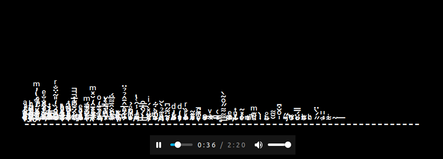

# Zalgo Player

Zalgo Player is a React component that implements a purely text based frequency analyzer, i.e. a "winamp style graph".



This is primarily meant to be a fun experiment to test the limits of text unicode text rendering in the browser, but the results are pretty metal.

For a more in-depth explanation of unicode combining characters and how this effect was achieved, my series of blog posts about the Unicode standard:

- [A deep dive into Unicode - I](https://techlead.net/a-deep-dive-into-unicode-part-1/)
- [A deep dive into Unicode - II](https://techlead.net/a-deep-dive-into-unicode-part-2/)

About the name: Zalgo is an internet horror meme of the early 2000s. See the [wikipedia](https://en.wikipedia.org/wiki/Zalgo_text) article for more details.

## Using the player

The player is available as an npm dependency. Simply npm install it:

```bash
$ npm install @felix.bruno/zalgo-player
```

### Component interface

| Attribute          | type      | Description                                                                                                                                                                                                                                                                      |
| ------------------ | --------- | -------------------------------------------------------------------------------------------------------------------------------------------------------------------------------------------------------------------------------------------------------------------------------- |
| mediaUrl           | string    | used to select the media that will be played. See https://developer.mozilla.org/en-US/docs/Web/HTML/Element/audio#src for additional details on the usage of the src attribute in Audio Element.                                                                                 |
| refreshRateMs      | number    | OPTIONAL desired refresh rate.The code will adapt and to try and honor this refresh rate. The minimum refresh rate corresponds to the refresh rate given by requestAnimationFrame. If this field is not set the code will default to the default requestAnimationFrame behavior. |
| numColumns         | number    | the number of "buckets" that the analyer FFT will yield. Each bucket will be displayed as a vertical bar. The number MUST be between 2^4 and 2^14.                                                                                                                               |
| mode               | ZalgoMode | the display mode of the player determines which combining characters are used so that the bars grow only to the top (TOP), only to the bottom (BOTTOM) or mirrored top and bottom (MIRROR)                                                                                       |
| maxCharacterPerCol | number    | maximum number of combining characters per column.In combination with the applied style determines the maximum height of the bar.                                                                                                                                                |
| styles             | CssModule | CSS Module styles. Please consult the README or demo app for an example of the styles that should be implemented.                                                                                                                                                                |

### Styling

When implementing the player in your application you MUST define the desired style.

The following classes should be defined for this component:

| CSS class name | Description                                           |
| -------------- | ----------------------------------------------------- |
| zalgoPlayer    | Wrapper div around the analyer ared and audio control |
| analyzerArea   | Div where the analyzer output will be rendered        |
| audioControl   | Div where the audio control is rendered               |

You can find example styles in the `src` folder:

- ZalgoMode.TOP - `./src/zalgo-style-top.module.css`
- ZalgoMode.BOTH - `./src/zalgo-style-both.module.css`
- ZalgoMode.BOTTOM - `./src/zalgo-style-bottom.module.css`

### Usage:

```javascript
import styleTop from "./zalgo-style-top.module.css";
import { ZalgoPlayer, ZalgoMode } from "@felix.bruno/zalgo-player";

<MyApp>
  <ZalgoPlayer
    mediaUrl="https://upload.wikimedia.org/wikipedia/commons/9/91/Ride_of_the_Valkyries.ogg"
    refreshRateMs={3}
    numColumns={64}
    maxCharacterPerCol={32}
    styles={styleTop}
    mode={ZalgoMode.TOP}
  />
</MyApp>;
```
